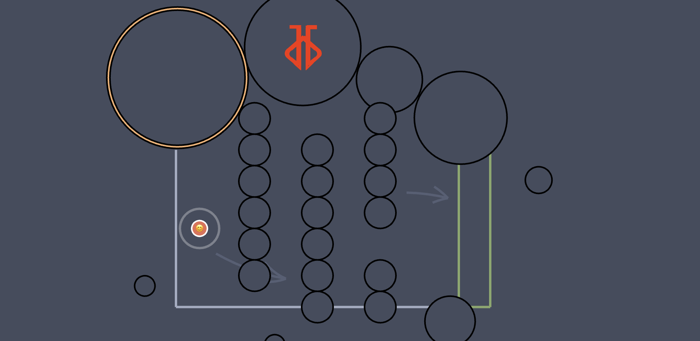

# Haxball Antibot

Plugin for checking if player is a Bot. Creates a **random map challenge** to be solved by chosen players. To be used with node package [haxball.js](https://github.com/mertushka/haxball.js)

## Installation
```
npm i hax-antibot
```

## Documentation
Website documentation is available at [jakjus.github.io/hax-antibot/](https://jakjus.github.io/hax-antibot/)

## Usage
1. Init Antibot as early as possible on your RoomObject 
```
const getStadium = initAntibot(room)
```
2. Choose which players to test
```
const playerIdsToCheck = room.getPlayerList().map(p => p.id)
```

3. Run Antibot
```
const result = await antibot(room, getStadium, playerIdsToCheck)
```

`result` will be an array of objects, consisting of Player ID's and if they failed the test:
```
[{ id: 2, failed: false}, { id: 5, failed: true }, ...]
```
4. Kick them (or do something else)
```
result.filter(p => p.failed).forEach(p => room.kickPlayer(p.id, "Failed reaching the green zone.", false))
```

## Example

```js
// room.ts
import HaxballJS from "haxball.js";
import { initAntibot, antibot } from "hax-antibot"

const getRoom = async () => {
  const HBInit = await HaxballJS
  const room = HBInit({
    roomName: 'test',
    token: 'thr1.AAAAAGUoFkn6N1TdUatJBg.bS6fQZYprgM'
  })
  return room
}

const run = async () => {
  const room = await getRoom()

  // Call init once on your room before any stadium changing commands
  const getStadium = initAntibot(room)

  room.onPlayerJoin = (p) => {
    room.setPlayerAdmin(p.id, true)
  }
  
  room.onPlayerChat = () => {
    performAntibot()
    return true
  }

  // Script changes the map
  room.setDefaultStadium("Big")


  // Example of your antibot function
  const performAntibot = async () => {
    // Choose who to check. You may filter the players to choose only players which are not AFK.
    const playerIdsToCheck = room.getPlayerList().map(p => p.id)

    // Run Antibot
    const result = await antibot(room, getStadium, playerIdsToCheck)

    // Perform action depending on 
    // You can choose what to do with failed player
    result.filter(p => p.failed).forEach(p => room.kickPlayer(p.id, "Failed reaching the green zone.", false))

    // Map will be changed back automatically. Set up the teams from remaining players and start the game.
  }

  room.onRoomLink = link => {
    console.log(link)
  }
}

run()
```

This code is also in [room.ts](example/room.ts).

## Build
```
npm run build
```
